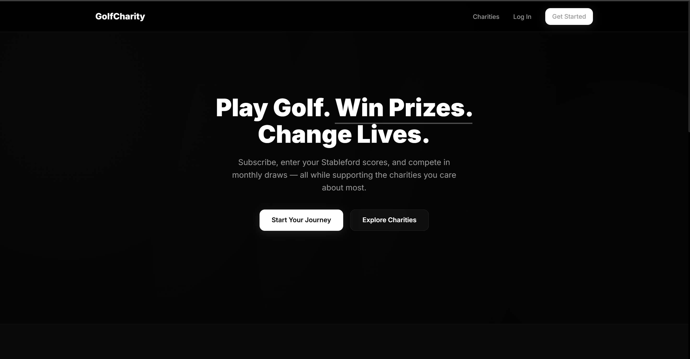
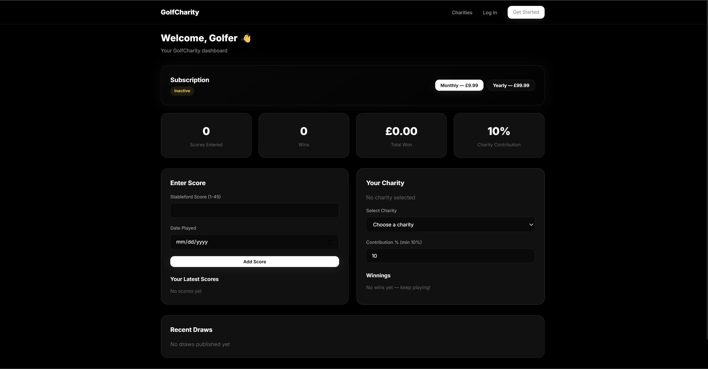
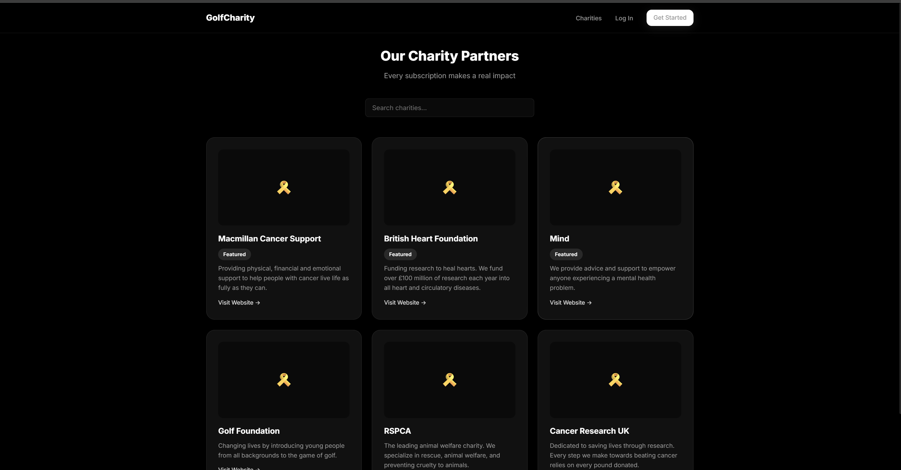
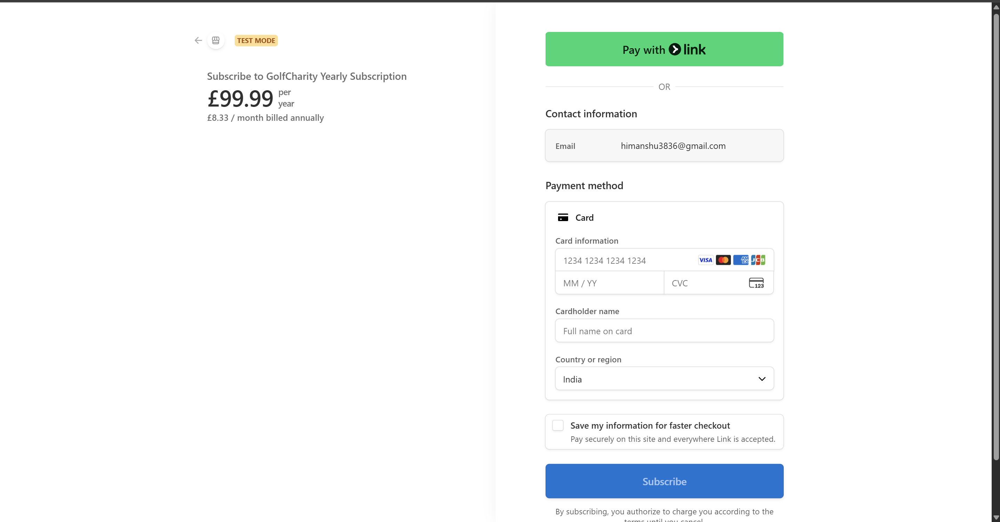

# ⛳ GolfCharity — Play. Win. Give Back.

A production-ready, subscription-based web application that combines golf performance tracking with monthly prize draws and charitable giving.

> **Live Demo:** [golf-portal.vercel.app](https://golf-portal-dt8c.vercel.app/) 

## Screenshots

| Landing Page | User Dashboard | Charities | Payment |
|:---:|:---:|:---:|:---:|
|  |  |  |  |
## Tech Stack

| Layer | Technology |
|---|---|
| **Framework** | Next.js 16 (App Router) |
| **Database & Auth** | Supabase (PostgreSQL + Row Level Security) |
| **Payments** | Stripe Checkout & Billing (Webhooks) |
| **Styling** | Custom Vanilla CSS — zero UI library dependencies |
| **Deployment** | Vercel |

---

## Key Technical Highlights

- **Row Level Security (RLS):** 12+ Supabase RLS policies ensure complete data isolation — users can only access their own data; admins have elevated access.
- **Stripe Webhook Integration:** Secure server-side webhook endpoint processes subscription lifecycle events (`checkout.session.completed`, `invoice.paid`, `customer.subscription.deleted`) to keep local subscription status in real-time sync.
- **Auth Middleware:** Next.js middleware intercepts requests to protected routes (`/dashboard`, `/admin`) and redirects unauthenticated users — no client-side flickering.
- **Database Triggers:** PostgreSQL trigger auto-creates a user profile on signup, ensuring referential integrity from the first request.
- **Zero UI Libraries:** The entire interface is built with a custom CSS design system (Inter font, dark theme, CSS variables, glassmorphism, micro-animations) — resulting in a lightweight, bespoke aesthetic with no bloated dependencies.

---

## Architecture

```
┌─────────────┐     ┌──────────────────┐     ┌─────────────┐
│   Next.js   │────▶│   API Routes     │────▶│  Supabase   │
│  Frontend   │     │  (Server-side)   │     │  (Postgres) │
│  (React)    │     │                  │     │  + Auth     │
└─────────────┘     └──────┬───────────┘     └─────────────┘
                           │
                    ┌──────▼───────────┐
                    │     Stripe       │
                    │  (Payments +     │
                    │   Webhooks)      │
                    └──────────────────┘
```

---

## Core Features

1. **Subscription Engine** — Monthly (£9.99) and yearly (£99.99) tiers managed via Stripe Checkout.
2. **Score Entry** — Users submit their latest Stableford scores (validated 1–45 range).
3. **Monthly Draw System** — Random or algorithmic draws with tiered prize pools (40% / 35% / 25% split).
4. **Charity Integration** — Users allocate 10–100% of their subscription to a selected charity.
5. **Admin Dashboard** — Full management panel: users, draws, charities, winner verification & payouts.
6. **Winner Verification** — Proof-of-score upload system with admin approval workflow.

---

## Getting Started

### Prerequisites
- Node.js 18+
- A [Supabase](https://supabase.com) project
- A [Stripe](https://stripe.com) account

### Installation

```bash
git clone https://github.com/Himansh133/Golf_Portal.git
cd Golf_Portal
npm install
```

### Environment Variables

Copy `.env.local.example` and fill in your keys:

```
NEXT_PUBLIC_SUPABASE_URL=your_supabase_url
NEXT_PUBLIC_SUPABASE_ANON_KEY=your_supabase_anon_key
SUPABASE_SERVICE_ROLE_KEY=your_supabase_service_role
STRIPE_SECRET_KEY=your_stripe_secret
NEXT_PUBLIC_STRIPE_PUBLISHABLE_KEY=your_stripe_pub_key
STRIPE_WEBHOOK_SECRET=your_stripe_webhook_secret
NEXT_PUBLIC_BASE_URL=http://localhost:3000
```

### Database Setup

Run `supabase-schema.sql` in your Supabase SQL Editor to create all tables, RLS policies, and triggers.

### Run Locally

```bash
npm run dev
```

---

## Project Structure

```
src/
├── app/
│   ├── admin/          # Admin dashboard (users, draws, charities, winners)
│   ├── api/            # API routes (auth, checkout, scores, draws, webhooks)
│   ├── charities/      # Public charity listing page
│   ├── dashboard/      # Authenticated user dashboard
│   ├── login/          # Login page
│   ├── signup/         # Registration page
│   ├── error.js        # Global error boundary
│   ├── loading.js      # Global loading state
│   ├── not-found.js    # Custom 404 page
│   └── layout.js       # Root layout with Navbar & Footer
├── components/         # Reusable UI components (Navbar, Footer)
├── lib/                # Supabase client utilities
└── middleware.js        # Auth route protection
```

---

## License

This project is licensed under the [MIT License](./LICENSE).